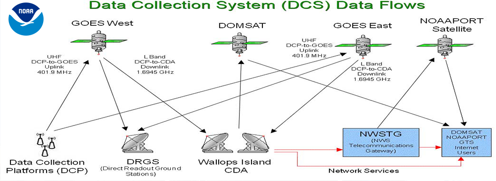

# DCS Service

NOAA Data Collection System

Since 1975, NESDIS has managed the U.S. Data Collection System. DCS is a system consisting of in-situ platforms that collect environmental information, the Geostationary Operational Environmental Satellites (GOES), an operational receiving and processing center located at the NOAA Command and Data Acquisition station in Wallops, Virginia, program management and oversight located at the NOAA Satellite Operations Facility (NSOF) in Suitland, Maryland, a second receiving and processing system located at the NSOF and several communications links for dissemination of the collected data. Environmental data are collected from platforms located primarily in remote areas (rivers, lakes, oceans, forests and rough terrain) all within the footprint of the NOAA geostationary East and West satellites. The GOES satellites act as the communications link between the remote platform and processing facility. After obtaining a Systems Use Agreement (SUA) with the National Environmental Satellite Data and Information Service (NESDIS), user data are uplinked to the GOES satellite (s), processed at Wallops or Suitland and made available to customers either directly from the GOES satellites or via the NOAA High Rate Information Transmission (HRIT/EMWIN) broadcasts, dial-in modem to Wallops or another dial-in system (e.g. EDDN) or through the DCS Administration and Data Distribution System (DADDS). Most environmental observations processed through GOES, along with observations within the footprint of the European EUMETSAT Meteosat and Japanese GMS satellites, are also available from the Global Telecommunications System (GTS) weather circuits. To receive information about the GTS, contact your local WMO office or national meteorological agency.

DCS customers include U.S. and international agencies responsible for monitoring environmental and earth resources where observations are needed frequently and quickly. Some examples include U.S. and Mexican Weather Service flood warning and forecasting, United States Geological Survey earthquake monitoring, and U.S. Forest Service forest fire operations.

Federal, state and local agencies monitor the environment through the transmission of observations from surface-based platforms to NOAA satellites. Decision-makers in the areas of emergency response and resource allocation depend on the GOES DCS.