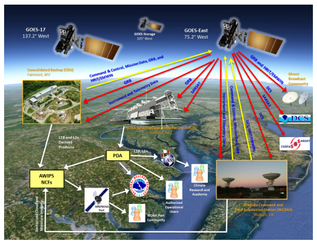

# LZSSc Service

Originally, Level Zero Storage Space Service.

NOAA’s National Environmental Satellite, Data, and Information Service (NESDIS) Office of Satellite and Product Operations (OSPO) operates the GOES-R series satellites, associated ground and support systems, and the product generation and distribution systems at NSOF in the Environmental Satellite Processing Center (ESPC). The ESPC distributes Level 1b products, Level 2+ products, and associated mission data through the Product Distribution and Access (PDA). Authorized operational customers receive GOES-R series products from the PDA. Product distribution through publicly accessible networks, such as the Internet, allows users with less stringent data availability requirements to receive Level 1b products without investing in satellite Direct Broadcast (DB) receive stations.

The GOES-R ground system operates at three NESDIS sites: NOAA Satellite Operations Facility (NSOF), Wallops Command and Data Acquisition Station (WCDAS), and Consolidated Backup (CBU) Facility. Additional details are in the GOES-R Series Ground Segment Project Functional and Performance Specification. The GOES-R series ground system consists of the following elements: Mission Management (MM), Product Generation (PG), Product Distribution (PD), and Enterprise Management (EM).

WCDAS hosts the primary space communications services, EM and MM functions, and selected PG and PD functions. The GOES R Series Product Definition and Users’ Guide (PUG) Volume 2 describes the Level 0 products. The Level 0 products are composed of Consultative Committee for Space Data Systems (CCSDS) packets that contain all of the science, housekeeping, engineering, and diagnostic telemetry data from the ABI, GLM, SUVI, EXIS, SEISS, and MAG instruments. The content and form of the CCSDS space packets in the Level 0 product files are exactly as generated by the instruments. The Level 0 product files also contain orbit and attitude/angular rate packets generated by the spacecraft. The type and format of each packet are indicated as a unique Application Process Identifier (APID).

WCDAS receives all of the Level 0 data products, and its PG function creates Level 1b and the GLM Level 2+ products in the Network Common Data Form (NetCDF) format, information packets, and metadata. WCDAS also maintains the Level Zero Storage Space (LZSS) access for authorized Calibration/Validation (Cal/Val) users. The GOES-R Product Readiness and Operations (PRO) Team can authorize access to the Level 0 files, Level 1b NetCDF files, and instrument calibration engineering files stored in the LZSS.

Level 0 data is the unprocessed instrument data at full resolution. L1b data is the L0 data processed with radiometric and geometric correction applied to produce parameters in physical units. L2+ data are derived environmental variables generated from L1b data along with other ancillary source data.

WCDAS then encodes the Level 1b and GLM Level 2+ products as CCSDS packets and transmits them, along with information and metadata packets, up to the satellite. The packets are relayed through the GRB transponder and L-Band antenna to the ground. The GRB receive stations at NSOF and other sites receive the GRB RF stream. The PG function at NSOF creates the rest of the L2+ products and distributes the Level 1b and Level 2+ products to the PD node.

The CBU functions as a completely independent backup for the MM and selected PG and PD functions for the production of KPPs and GRB products, and it can operate concurrently with the NSOF and the WCDAS. Its X-Band antenna receives the Level 0 data and the PG function produces the GRB products, information packets, and metadata that are uplinked to the satellite for relay through the GRB. The CBU can also generate the KPPs, including the SCMI products for the National Weather Service (NWS).

NSOF hosts the primary MM and selected PG and PD functions and is responsible for maintaining the calibration database, monitoring radiometric performance, monitoring Image Navigation and Registration (INR) performance, generating Level 2+ products, and disseminating Level 1b and Level 2+ products.

As described in the Environmental Satellite Processing and Distribution System (ESPDS) Development Enterprise System Requirements Document (ESRD), the ESPC at NSOF is NOAA's primary data-processing system for the nation's environmental satellite data. Through a large variety of hardware, software, networks, telecommunication lines, and software tools, the ESPC ingests, processes, and distributes environmental data and information received from all of NOAA's satellites, several foreign countries' satellites and the Department of Defense's satellites. The PDA is the product distribution node in the ESPC at NSOF that distributes Level 1b products, Level 2+ products, and associated mission data.
